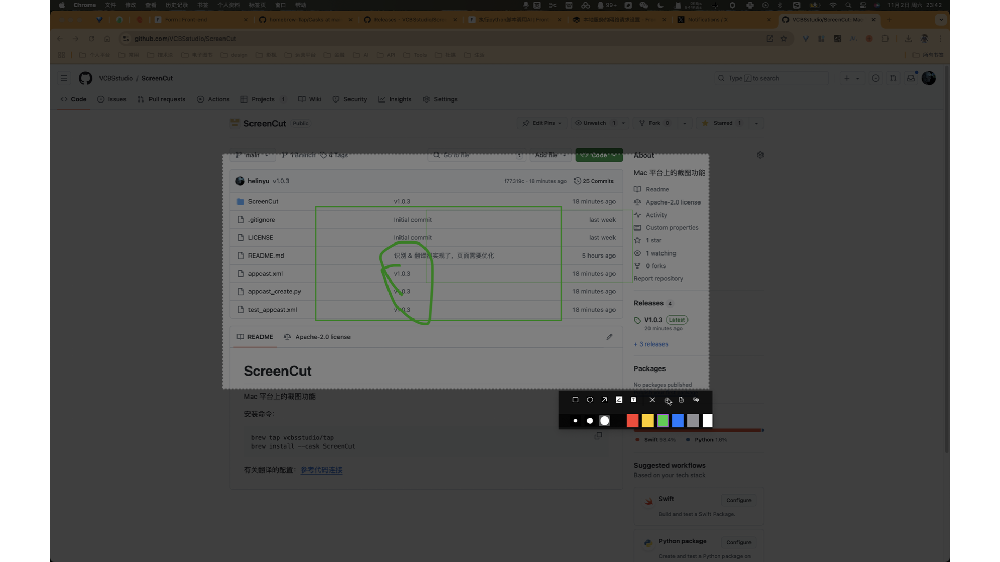

# ScreenCut
Mac 平台上的截图功能

安装命令：
```
brew tap vcbsstudio/tap 
brew install --cask ScreenCut
```

可以到偏好设置中设置截图的快捷键： eg : control + x 




### 提供的功能
1、截图 <br/>
2、矩形框 绘制 <br/>
3、椭圆形 绘制 <br/>
4、箭头 绘制 <br/>
5、随意涂鸦 绘制 <br/>
6、文本添加 <br/>
7、识别选择框中的文字
8、将选择框内容的文字翻译 【需要自行配置，[参考教程](https://hly-tech.gitbook.io/front-end/front-end/apple/library/coreml/zhi-xing-python-jiao-ben-diao-yong-ai/shi-yong-rest-api)， [代码目录](./backend/translate.py)】 <br/>

#### 其中还包括：
1、选择字体大小以及线条的大小  <br/>
2、颜色的选择 <br/>